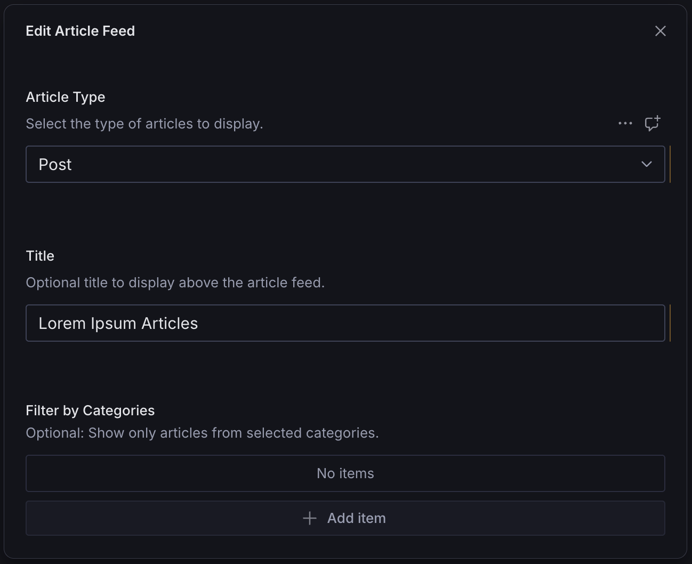
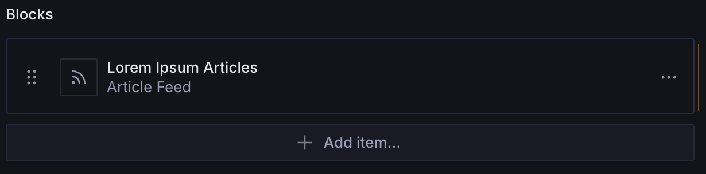
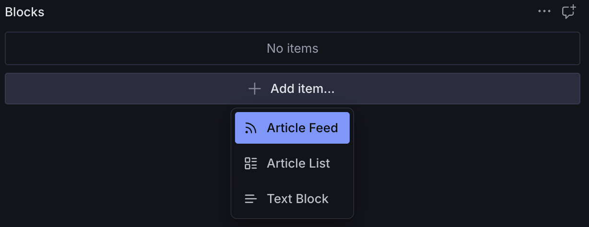

# Article Feed Block

A configurable page builder block for displaying a feed of articles, blog posts, or other structured content. Supports customizable fields, custom fields, and previews.





## Overview

The Article Feed Block is a block that signals to your queries and frontend frameworks to render a feed of a given document type. It is _not_ for selecting "featured" articles.

For example, you may have a blog listing page at `/blog` where you want to display your latest blog posts. You _could_ hard-code that route in your frontend framework and just query the posts directly. That's totally fine.

But you might choose to implement your blog using the [Page Approach](https://www.trenda.dev/blog/how-to-manage-your-homepage-in-sanity-studio#the-page-approach-732fe6d88f05), in which case you'd have a page builder field with various page blocks, such as a `hero` block and an `articleFeedBlock`.

The reason this is an "article" feed block is because "article" is a generic term not just referring to news or blog articles. Maybe you have a podcast with an `episode` schema or a food blog with a `recipe` schema or even an e-commerce store with a `product` schema.

An example query might look like this, where `articleType` is a customizable field on the Article Feed Block:

```ts
{
  export const PAGE_QUERY = groq`*[_type == "page" && slug.current == $slug][0] {
    // ...
    blocks[] {
      _type,
      _key,
      _type == "articleFeedBlock" => {
        "articles": *[_type == ^.articleType && defined(slug.current)] {
          ^.articleType == "post" => {
            // ...
          },
          ^.articleType == "episode" => {
            // ...
          },
          ^.articleType == "recipe" => {
            // ...
          },
        }
      },
    },
  }`
}
```

Then in your frontend code, you might render it like this:

```tsx
<Feed>
  {articles.map((article) => (
    <article key={article._key}>{article.title}</article>
  ))}
</Feed>
```

## Installation

```sh
npm install @trenda/sanity-plugin-page-blocks
```

## Usage

Add it as a plugin in `sanity.config.ts` (or .js):

```ts
import {defineConfig} from 'sanity'
import {articleFeedBlock} from '@trenda/sanity-plugin-page-blocks'

export default defineConfig({
  //...
  plugins: [articleFeedBlock()],
})
```

Register it in the schema where you plan to use it:

```ts
import {defineField, defineType} from 'sanity'

export const page = defineType({
  name: 'page',
  title: 'Page',
  type: 'document',
  fields: [
    //...
    defineField({
      name: 'blocks',
      title: 'Blocks',
      type: 'array',
      of: [{type: 'articleFeedBlock'}],
    }),
  ],
})
```

Use it in the Studio:



### Customization

#### Article Types

```ts
import {defineConfig, defineField} from 'sanity'
import {articleFeedBlock} from '@trenda/sanity-plugin-page-blocks'

const articleTypes = ['post', 'episode', 'recipe']

export default defineConfig({
  //...
  plugins: [
    articleFeedBlock({
      articleTypes,
    }),
  ],
})
```

#### Header

By default, `articleFeedBlock` uses a simple `string` field for the header.

```ts
defineField({
  name: 'title',
  title: 'Title',
  type: 'string',
  description: 'Optional title to display above the article feed.',
})
```

You may choose to override it with a different kind of field:

```ts
import {defineConfig, defineField} from 'sanity'
import {articleFeedBlock} from '@trenda/sanity-plugin-page-blocks'

export default defineConfig({
  //...
  plugins: [
    articleFeedBlock({
      header: defineField({
        name: 'header',
        title: 'Custom Header',
        type: 'portableText',
      }),
    }),
  ],
})
```

#### Filtering

`articleFeedBlock` comes with a `filterBy` field with which you can filter your queries on your frontend, but you need to pass the schema types to it first.

```ts
import {defineConfig, defineField} from 'sanity'
import {articleFeedBlock} from '@trenda/sanity-plugin-page-blocks'

export default defineConfig({
  //...
  plugins: [
    articleFeedBlock({
      filterBy: {
        schemaType: [
          {
            type: 'category',
          },
          {
            type: 'tag',
          },
        ],
      },
    }),
  ],
})
```

#### Other

See main [README](../../README.md) for more customizations.

## License

[MIT](LICENSE) © James Trenda

## Develop & test

This plugin uses [@sanity/plugin-kit](https://github.com/sanity-io/plugin-kit)
with default configuration for build & watch scripts.

See [Testing a plugin in Sanity Studio](https://github.com/sanity-io/plugin-kit#testing-a-plugin-in-sanity-studio)
on how to run this plugin with hotreload in the studio.

### Release new version

Run ["CI & Release" workflow](TODO/actions/workflows/main.yml).
Make sure to select the main branch and check "Release new version".

Semantic release will only release on configured branches, so it is safe to run release on any branch.
