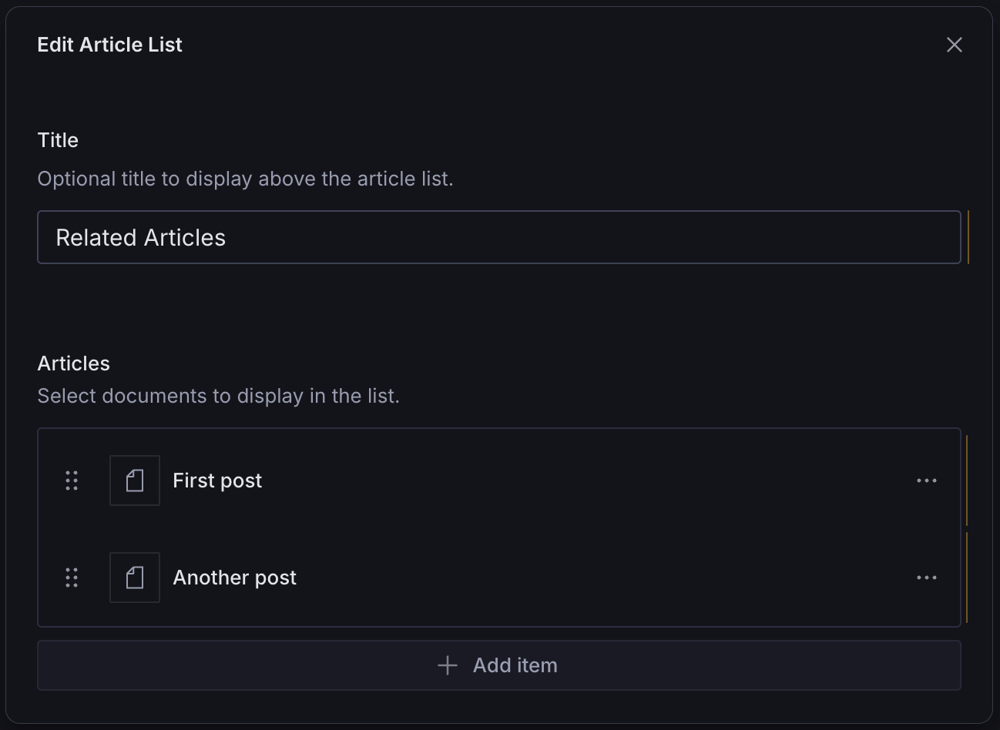
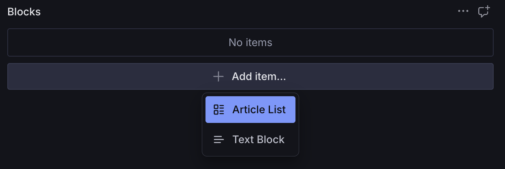

# Article List Block

A configurable page builder block for displaying a list of articles, blog posts, or other structured content. Supports customizable fields, custom fields, and previews.



## Overview

The Article List Block is a block that signals to your queries and frontend frameworks to render a list of a given document type. It is _not_ for selecting "featured" articles.

For example, you may have a blog listing page at `/blog` where you want to display your latest blog posts. You _could_ hard-code that route in your frontend framework and just query the posts directly. That's totally fine.

But you might choose to implement your blog using the [Page Approach](https://www.trenda.dev/blog/how-to-manage-your-homepage-in-sanity-studio#the-page-approach-732fe6d88f05), in which case you'd have a page builder field with various page blocks, such as a `hero` block and an `articleListBlock`.

The reason this is an "article" list block is because "article" is a generic term not just referring to news or blog articles. Maybe you have a podcast with an `episode` schema or a food blog with a `recipe` schema or even an e-commerce store with a `product` schema.

An example query might look like this, where `articleType` is a customizable field on the Article List Block:

```ts
{
  export const PAGE_QUERY = groq`*[_type == "page" && slug.current == $slug][0] {
    // ...
    blocks[] {
      _type,
      _key,
      _type == "articleListBlock" => {
        "articles": *[_type == ^.articleType && defined(slug.current)] {
          ^.articleType == "post" => {
            // ...
          },
          ^.articleType == "episode" => {
            // ...
          },
          ^.articleType == "recipe" => {
            // ...
          },
        }
      },
    },
  }`
}
```

Then in your frontend code, you might render it like this:

```tsx
<ArticleList>
  {articles.map((article) => (
    <article key={article._key}>{article.title}</article>
  ))}
</ArticleList>
```

## Installation

```sh
npm install @trenda/sanity-plugin-page-blocks
```

## Usage

Add it as a plugin in `sanity.config.ts` (or .js):

```ts
import {defineConfig} from 'sanity'
import {articleListBlock} from '@trenda/sanity-plugin-page-blocks'

export default defineConfig({
  //...
  plugins: [articleListBlock()],
})
```

Register it in the schema where you plan to use it:

```ts
import {defineField, defineType} from 'sanity'

export const page = defineType({
  name: 'page',
  title: 'Page',
  type: 'document',
  fields: [
    //...
    defineField({
      name: 'blocks',
      title: 'Blocks',
      type: 'array',
      of: [{type: 'articleListBlock'}],
    }),
  ],
})
```

Use it in the Studio:



### Customization

You can customize the `articleListBlock` schema by passing options when registering the plugin.

#### Example: Custom Schema Name

In Sanity, you cannot register multiple schemas with the same name. If you run into a naming conflict with your own `articleListBlock` schema, you can override it by passing a custom value to `name`.

```ts
import {defineConfig, defineField} from 'sanity'
import {articleListBlock} from '@trenda/sanity-plugin-page-blocks'

export default defineConfig({
  //...
  plugins: [
    articleListBlock({
      name: 'myArticleListBlock',
      //...
    }),
  ],
})
```

#### Example: Custom Article Types

```ts
import {defineConfig, defineField} from 'sanity'
import {articleListBlock} from '@trenda/sanity-plugin-page-blocks'

const articleTypes = ['post', 'episode', 'recipe']

export default defineConfig({
  //...
  plugins: [
    articleListBlock({
      articleTypes,
    }),
  ],
})
```

#### Example: Header Field

By default, `articleListBlock` uses a simple `string` field for the header.

```ts
defineField({
  name: 'title',
  title: 'Title',
  type: 'string',
  description: 'Optional title to display above the article list.',
})
```

You may choose to override it with a different kind of field:

```ts
import {defineConfig, defineField} from 'sanity'
import {articleListBlock} from '@trenda/sanity-plugin-page-blocks'

export default defineConfig({
  //...
  plugins: [
    articleListBlock({
      header: defineField({
        name: 'header',
        title: 'Custom Header',
        type: 'portableText',
      }),
    }),
  ],
})
```

#### Example: Category Field

By default, `articleListBlock` creates a `category` schema and references it in a `categories` field to satisfy the Sanity schema engine. If you pass a value to `categoryField`, as in the example below, the plugin will _not_ create a `category` schema for you.

```ts
defineField({
  name: 'categories',
  title: 'Filter by Categories',
  type: 'array',
  of: [{type: 'reference', to: [{type: 'category'}]}],
  description: 'Optional: Show only articles from selected categories.',
})
```

If your project uses a different schema name (e.g., tags), or if you want to change other things about the field, you can override it with your own field:

```ts
import {defineConfig, defineField} from 'sanity'
import {articleListBlock} from '@trenda/sanity-plugin-page-blocks'

export default defineConfig({
  //...
  plugins: [
    articleListBlock({
      categoryField: defineField({
        name: 'tags',
        title: 'Filter by Tag',
        type: 'array',
        of: [{type: 'reference', to: [{type: 'tag'}]}],
        description: 'Optional: Show only articles from selected tags.',
      }),
    }),
  ],
})
```

#### Example: Custom Fields

You can extend the schema with additional fields:

```ts
import {defineConfig, defineField} from 'sanity'
import {articleListBlock} from '@trenda/sanity-plugin-page-blocks'

export default defineConfig({
  //...
  plugins: [
    articleListBlock({
      customFields: [
        defineField({
          name: 'myCustomField',
          title: 'My Custom Field',
          type: 'string',
        }),
      ],
    }),
  ],
})
```

#### Example: Custom Preview

You can add your own preview config:

```ts
import {defineConfig, defineField} from 'sanity'
import {articleListBlock} from '@trenda/sanity-plugin-page-blocks'

export default defineConfig({
  //...
  plugins: [
    articleListBlock({
      header: defineField({
        name: 'header',
        title: 'Custom Header',
        type: 'portableText',
      }),
      // custom preview config
      preview: {
        select: {
          header: 'header',
        },
        prepare(selection) {
          // NOTE: Not an exported function with this plugin
          const preview = getPortableTextPreview(selection.header, 'Article List')

          return preview
        },
      },
    }),
  ],
})
```

## License

[MIT](LICENSE) © James Trenda

## Develop & test

This plugin uses [@sanity/plugin-kit](https://github.com/sanity-io/plugin-kit)
with default configuration for build & watch scripts.

See [Testing a plugin in Sanity Studio](https://github.com/sanity-io/plugin-kit#testing-a-plugin-in-sanity-studio)
on how to run this plugin with hotreload in the studio.

### Release new version

Run ["CI & Release" workflow](TODO/actions/workflows/main.yml).
Make sure to select the main branch and check "Release new version".

Semantic release will only release on configured branches, so it is safe to run release on any branch.
