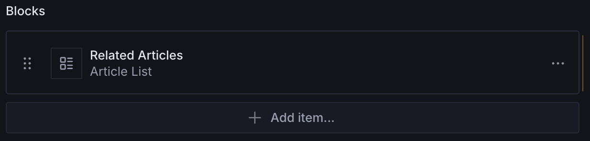
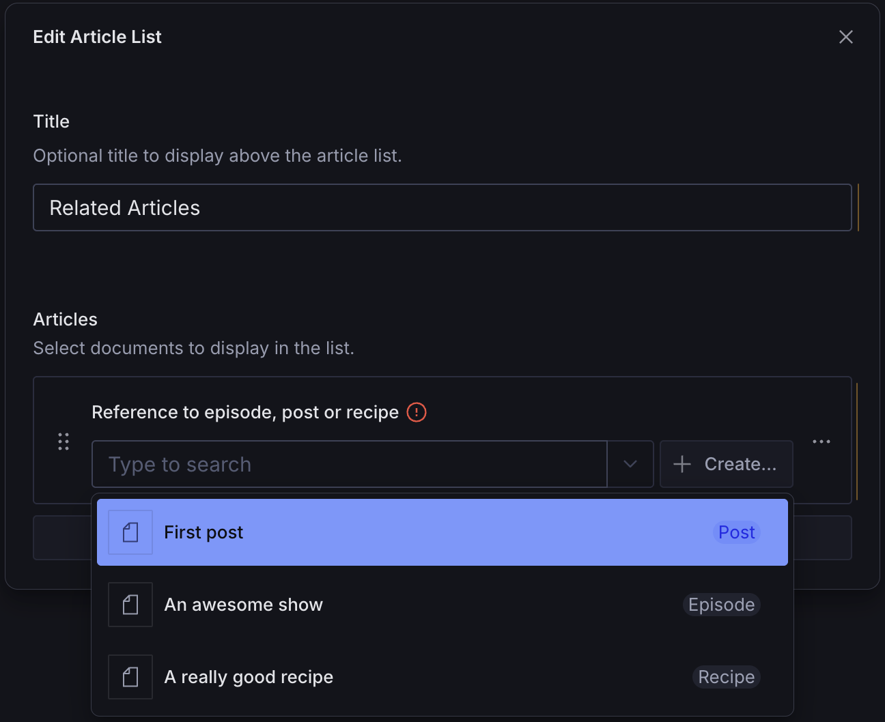
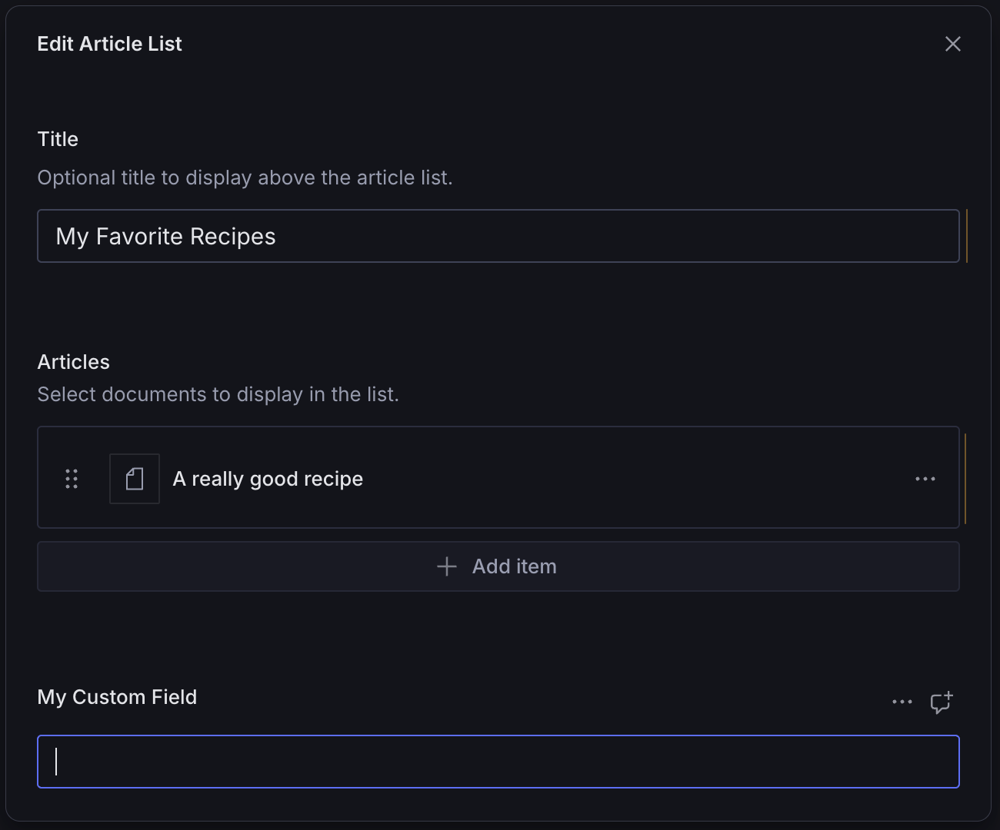
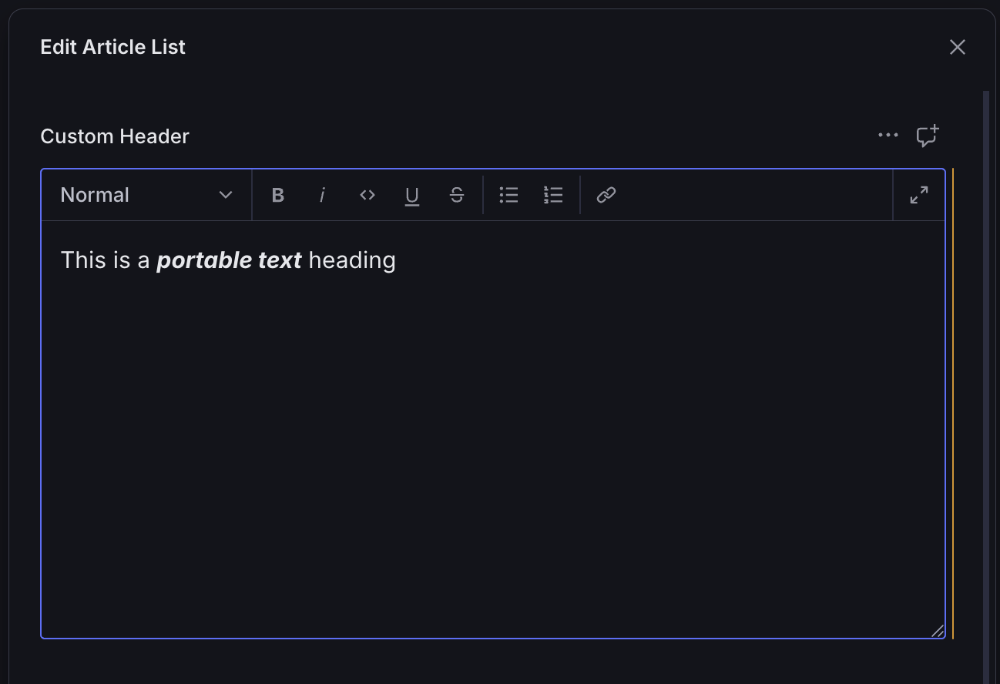
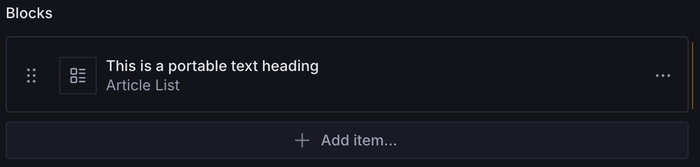

# Article List Block

A configurable page builder block for displaying a list of selected articles, blog posts, or other documents. Supports customizable fields, custom fields, and previews.




## Installation

```sh
npm install @trenda/sanity-plugin-page-blocks
```

## Usage

Add it as a plugin in `sanity.config.ts` (or .js):

```ts
import {defineConfig} from 'sanity'
import {articleListBlock} from '@trenda/sanity-plugin-page-blocks'

export default defineConfig({
  //...
  plugins: [articleListBlock()],
})
```

Register it in the schema where you plan to use it:

```ts
import {defineField, defineType} from 'sanity'

export const page = defineType({
  name: 'page',
  title: 'Page',
  type: 'document',
  fields: [
    //...
    defineField({
      name: 'blocks',
      title: 'Blocks',
      type: 'array',
      of: [{type: 'articleListBlock'}],
    }),
  ],
})
```

Use it in the Studio:


### Customization

You can customize the `articleListBlock` schema by passing options when registering the plugin.

#### Example: Custom Schema Name

In Sanity, you cannot register multiple schemas with the same name. If you run into a naming conflict with your own `articleListBlock` schema, you can override it by passing a custom value to `name`.

```ts
import {defineConfig, defineField} from 'sanity'
import {articleListBlock} from '@trenda/sanity-plugin-page-blocks'

export default defineConfig({
  //...
  plugins: [
    articleListBlock({
      name: 'myArticleListBlock',
      //...
    }),
  ],
})
```

#### Example: Custom Block Header

By default, `articleListBlock` uses a simple `string` field for the header.

```ts
defineField({
  name: 'title',
  title: 'Title',
  type: 'string',
  description: 'Optional title to display above the article list.',
})
```

You may choose to override it with a different kind of field:

```ts
import {defineConfig, defineField} from 'sanity'
import {articleListBlock} from '@trenda/sanity-plugin-page-blocks'

export default defineConfig({
  //...
  plugins: [
    articleListBlock({
      header: defineField({
        name: 'header',
        title: 'Custom Header',
        type: 'array',
        of: [{type: 'block'}],
      }),
    }),
  ],
})
```

#### Example: Articles

The Article List Block requires an `options` object with the only required property being `articleTypes`. The value of `articleTypes` is used to populate the `articles` array field with the appropriate reference types.

```ts
import {defineConfig, defineField} from 'sanity'
import {articleListBlock} from '@trenda/sanity-plugin-page-blocks'

const articleTypes = ['post', 'episode', 'recipe']

export default defineConfig({
  //...
  plugins: [
    articleListBlock({
      articleTypes,
    }),
  ],
})
```



#### Example: Custom Fields

You can extend the schema with additional fields:

```ts
import {defineConfig, defineField} from 'sanity'
import {articleListBlock} from '@trenda/sanity-plugin-page-blocks'

export default defineConfig({
  //...
  plugins: [
    articleListBlock({
      customFields: [
        defineField({
          name: 'myCustomField',
          title: 'My Custom Field',
          type: 'string',
        }),
      ],
    }),
  ],
})
```



#### Example: Custom Preview

You can add your own preview config:

```ts
import {defineConfig, defineField} from 'sanity'
import {articleListBlock, getPortableTextPreview} from '@trenda/sanity-plugin-page-blocks'

export default defineConfig({
  //...
  plugins: [
    articleListBlock({
      header: defineField({
        name: 'header',
        title: 'Custom Header',
        type: 'array',
        of: [{type: 'block'}],
      }),
      // custom preview config
      preview: {
        select: {
          header: 'header',
        },
        prepare(selection) {
          const preview = getPortableTextPreview(selection.header, 'Article List')

          return preview
        },
      },
    }),
  ],
})
```





## License

[MIT](LICENSE) © James Trenda

## Develop & test

This plugin uses [@sanity/plugin-kit](https://github.com/sanity-io/plugin-kit)
with default configuration for build & watch scripts.

See [Testing a plugin in Sanity Studio](https://github.com/sanity-io/plugin-kit#testing-a-plugin-in-sanity-studio)
on how to run this plugin with hotreload in the studio.

### Release new version

Run ["CI & Release" workflow](TODO/actions/workflows/main.yml).
Make sure to select the main branch and check "Release new version".

Semantic release will only release on configured branches, so it is safe to run release on any branch.
