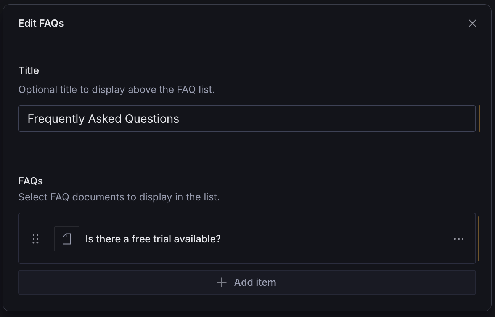
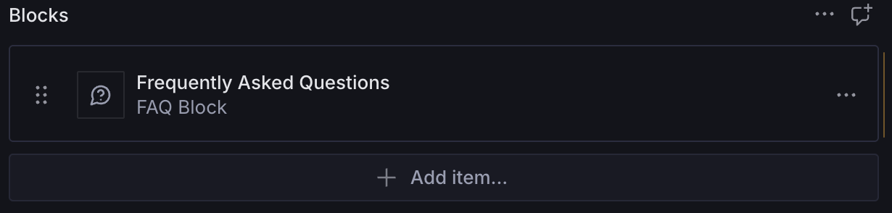

# FAQ Block

A configurable page builder block for displaying a collection of frequently asked questions.





## Installation

```sh
npm install @trenda/sanity-plugin-page-blocks
```

## Usage

Add it as a plugin in `sanity.config.ts` (or .js):

```ts
import {defineConfig} from 'sanity'
import {faqBlock} from '@trenda/sanity-plugin-page-blocks'

export default defineConfig({
  //...
  plugins: [
    faqBlock({
      faqs: {
        schemaType: [
          {
            type: 'faq',
          },
        ],
      },
    }),
  ],
})
```

Register it in the schema where you plan to use it:

```ts
import {defineField, defineType} from 'sanity'

export const page = defineType({
  name: 'page',
  title: 'Page',
  type: 'document',
  fields: [
    //...
    defineField({
      name: 'blocks',
      title: 'Blocks',
      type: 'array',
      of: [{type: 'faqBlock'}],
    }),
  ],
})
```

Use it in the Studio:


### Customization

You can customize the `faqBlock` schema by passing options when registering the plugin.

#### Header

By default, `faqBlock` uses a simple `string` field for the header.

```ts
defineField({
  name: 'title',
  title: 'Title',
  type: 'string',
  description: 'Optional title to display above the FAQs.',
})
```

You may choose to override it with a different kind of field:

```ts
import {defineConfig, defineField} from 'sanity'
import {faqBlock} from '@trenda/sanity-plugin-page-blocks'

export default defineConfig({
  //...
  plugins: [
    faqBlock({
      header: defineField({
        name: 'header',
        title: 'Custom Header',
        type: 'array',
        of: [{type: 'block'}],
      }),
    }),
  ],
})
```

#### Schema Type

By default, the FAQ Block block does not specify a schema type for you. Instead, you must pass your own schema to it.

```ts
import {defineConfig} from 'sanity'
import {faqBlock} from '@trenda/sanity-plugin-page-blocks'

export default defineConfig({
  //...
  plugins: [
    faqBlock({
      faqs: {
        schemaType: [
          {
            type: 'faq',
          },
        ],
      },
    }),
  ],
})
```

## Demo

A Next.js [demo](https://sanity-page-blocks-demo.vercel.app/faq-block) with a header customization.

## License

[MIT](LICENSE) © James Trenda

## Develop & test

This plugin uses [@sanity/plugin-kit](https://github.com/sanity-io/plugin-kit)
with default configuration for build & watch scripts.

See [Testing a plugin in Sanity Studio](https://github.com/sanity-io/plugin-kit#testing-a-plugin-in-sanity-studio)
on how to run this plugin with hotreload in the studio.

### Release new version

Run ["CI & Release" workflow](TODO/actions/workflows/main.yml).
Make sure to select the main branch and check "Release new version".

Semantic release will only release on configured branches, so it is safe to run release on any branch.
