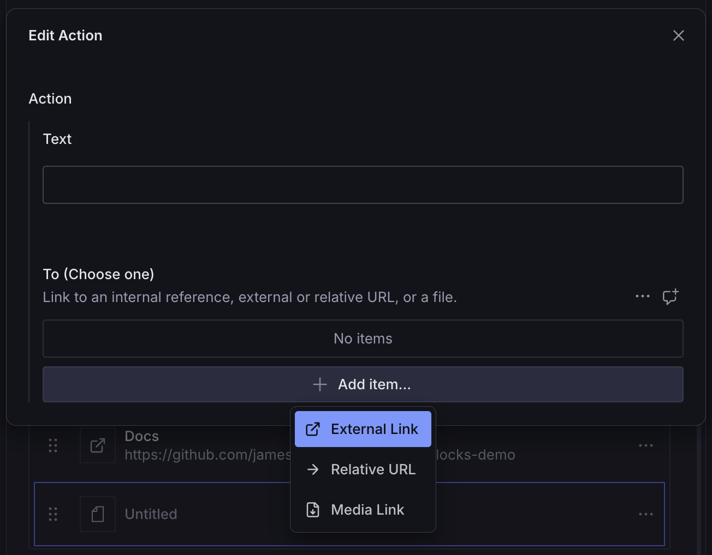

# Hero Block

A configurable page builder block for hero sections, featuring three essential fields—text, image, and actions—each designed for common hero section needs. Each field can be extended, customized, or even hidden if necessary, keeping the interface streamlined with just the fields you want.

## Installation

```sh
npm install @trenda/sanity-plugin-page-blocks
```

## Usage

Add it as a plugin in `sanity.config.ts`:

```ts
import {defineConfig} from 'sanity'
import {heroBlock} from '@trenda/sanity-plugin-page-blocks'

export default defineConfig({
  //...
  plugins: [heroBlock()],
})
```

Register it in the schema where you plan to use it:

```ts
import {defineField, defineType} from 'sanity'

export const page = defineType({
  name: 'page',
  title: 'Page',
  type: 'document',
  fields: [
    //...
    defineField({
      name: 'blocks',
      title: 'Blocks',
      type: 'array',
      of: [{type: 'heroBlock'}],
    }),
  ],
})
```

Use it in the Studio:


### Customization

You can customize the `heroBlock` schema by passing options when registering the plugin.

#### Schema Name

In Sanity, you cannot register multiple schemas with the same name. If you run into a naming conflict with your own `heroBlock` schema, or if you wish to register multiple variations of the block, you can override it by passing a custom value to `name`.

```ts
import {defineConfig} from 'sanity'
import {heroBlock} from '@trenda/sanity-plugin-page-blocks'

export default defineConfig({
  //...
  plugins: [
    // register two hero blocks:
    heroBlock(), // <-- name is 'heroBlock' by default
    heroBlock({
      name: 'simpleHero',
      text: 'string',
      actions: false,
    }),
  ],
})
```

#### Text Field

By default, `heroBlock` includes a simplified PortableText block schema, including just `normal` and `h1` block styles:


If this doesn't meet your needs, you can override the defaults by passing your own `BlockStyleDefinition` array, just as you would in any other context.

```ts
import {defineConfig} from 'sanity'
import {heroBlock} from '@trenda/sanity-plugin-page-blocks'
import {Overline} from '@/components/overline'

export default defineConfig({
  //...
  plugins: [
    heroBlock({
      text: {
        styles: [
          // 'normal' style is always defined.
          {
            title: 'Heading',
            value: 'h1',
          },
          {
            title: 'Overline',
            value: 'overline',
            component: Overline,
          },
        ],
        // these less common styles are included by default but you can
        // remove them just as you normally would by passing an empty array
        lists: [],
        annotations: [],
      },
    }),
  ],
})
```


##### Simple Hero Variation

You probably wouldn't do this often, but you could:

```ts
import {defineConfig} from 'sanity'
import {heroBlock} from '@trenda/sanity-plugin-page-blocks'

export default defineConfig({
  //...
  plugins: [
    heroBlock({
      name: "simpleHero",
      text: {
        type: "string"
      }
      image: false,
      actions: false
    }),
  ],
})
```


#### Image Fields

By default, `heroBlock` includes an image schema with Hotspot & Crop enabled, as well as a text field for alternate text:


In Sanity, you can enter alt text on the asset itself, but sometimes you might want to use an _alternate_ alt text. If you need additional image fields, you can add those when registering the plugin:

```ts
import {defineConfig, defineField} from 'sanity'
import {heroBlock} from '@trenda/sanity-plugin-page-blocks'

export default defineConfig({
  //...
  plugins: [
    heroBlock({
      image: {
        customFields: [
          defineField({
            name: 'myCustomField',
            title: 'A Custom Field',
            type: 'string',
            validation: (Rule) => Rule.required(),
          }),
        ],
      },
    }),
  ],
})
```


#### Validation

You can add schema validation props to the image field. In this case, the image field is actually a custom `object` that has its own fields (`file` and `altText`). Therefore, simplying applying validation to the object won't ensure that an image is actually uploaded. For instance, if `altText` contains a value, but `file` does not, the parent object will pass validation. Therefore, each nested field also accepts a `validation` prop.

```ts
import {defineConfig, defineField} from 'sanity'
import {heroBlock} from '@trenda/sanity-plugin-page-blocks'

export default defineConfig({
  //...
  plugins: [
    heroBlock({
      image: {
        validation: (Rule) => Rule.required(), // require the image object as a whole
        file: {
          // ensures that an image file is uploaded if alt text is provided
          validation: (Rule) =>
            Rule.custom((value, context) => {
              // Check if alt text exists but image doesn't
              const parent = context?.parent as {altText?: string}
              if (parent?.altText && !value?.asset?._ref) {
                return 'Image is required when alt text is provided'
              }

              return true
            }),
        },
      },
    }),
  ],
})
```

#### Custom Fields

I tried to use sensible defaults. However, if you find yourself needing to heavily customize the `file` or `altText` fields, or you have your own tailor-made image field that you want to use instead, you can simply remove the image field from the schema and add your own.

```ts
import {defineConfig, defineField} from 'sanity'
import {heroBlock} from '@trenda/sanity-plugin-page-blocks'

export default defineConfig({
  //...
  plugins: [
    heroBlock({
      image: false,
      customFields: [
        defineField({
          name: 'myCustomImage',
          title: 'Custom Image',
          type: 'myCustomImage', // or whatever your image type name is
        }),
      ],
    }),
  ],
})
```

#### Actions

The `actions` field supports a variety of call-to-action (CTA) types out of the box, including:

- External URLs
- Relative URLs (for when you just need to link to an otherwise unreachable internal URL)
- Media links (for linking to downloadable assets like PDFs)



Undoubtedly, you'll also want to have additional linking capabilities for your reference types. In that case, you can extend the `actions` field like so:

```ts
import {defineConfig} from 'sanity'
import {heroBlock} from '@trenda/sanity-plugin-page-blocks'

export default defineConfig({
  //...
  plugins: [
    heroBlock({
      actions: {
        internal: {
          types: [{type: 'page'}], // add any reference types for which you have slugs
        },
      },
    }),
  ],
})
```

##### Design Rationale and 'To' Field Implementation

In keeping with a flexible and minimally opinionated philosophy, the term "actions" was chosen intentionally over alternatives like "buttons" or "links." While these elements often take the form of buttons, their core purpose is to guide users toward specific interactions—whether it's navigating to another page, downloading a file, or triggering an event. Additionally, the visual representation of actions may vary depending on the design, so calling them "buttons" outright could create unnecessary confusion.

###### Schema Structure and Query Clarity

Wherever possible, I've chosen to use inline objects rather than separately named schema types. This keeps the plugin more self-contained and avoids mandatory declarations in the `schema.types` array of your Studio configuration.

However, this comes with the trade-off of necessarily longer, more complex query structures in your frontend code. For example, instead of being able to write `action.url` or even `action.to[0].url`, you'll have to write `action.to[0].link.url`.

Example of how this fits into a full query: [Actions Query Example](https://github.com/jamestrenda/sanity-page-blocks-demo/blob/main/packages/sanity/queries.ts)

###### Why Use an Array for the 'To' Field?

A common pattern for handling different link types (internal, external, file, etc.) is to use a "button type" field that conditionally shows or hides corresponding fields. While effective, this approach introduces conditional validation complexity and can lead to stale data when switching between types.

Instead, the 'To' field is defined as an array limited to a single item, which provides:

- ✅ Cleaner schema – No need for multiple conditionally rendered fields.
- ✅ No stale data risk – Switching types doesn’t leave behind unused hidden data.
- ✅ Simpler validation – A single validation rule ensures only one item is present.

###### Preventing Multiple Entries

Since 'To' is an array, it technically allows multiple items. However, this is not the intended behavior. To enforce the single-item constraint, validation prevents saving if more than one item is added.

This trade-off makes the schema easier to maintain and reason about. Once understood, it provides a clear and flexible way to define actions without unnecessary complexity.

## License

[MIT](../../LICENSE) © James Trenda

## Develop & test

This plugin uses [@sanity/plugin-kit](https://github.com/sanity-io/plugin-kit)
with default configuration for build & watch scripts.

See [Testing a plugin in Sanity Studio](https://github.com/sanity-io/plugin-kit#testing-a-plugin-in-sanity-studio)
on how to run this plugin with hotreload in the studio.

### Release new version

Run ["CI & Release" workflow](TODO/actions/workflows/main.yml).
Make sure to select the main branch and check "Release new version".

Semantic release will only release on configured branches, so it is safe to run release on any branch.
