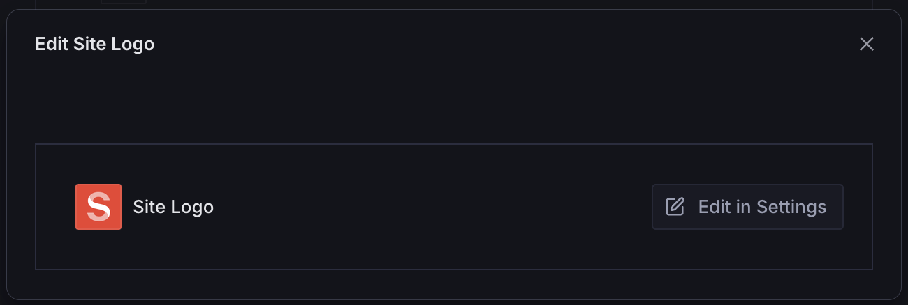
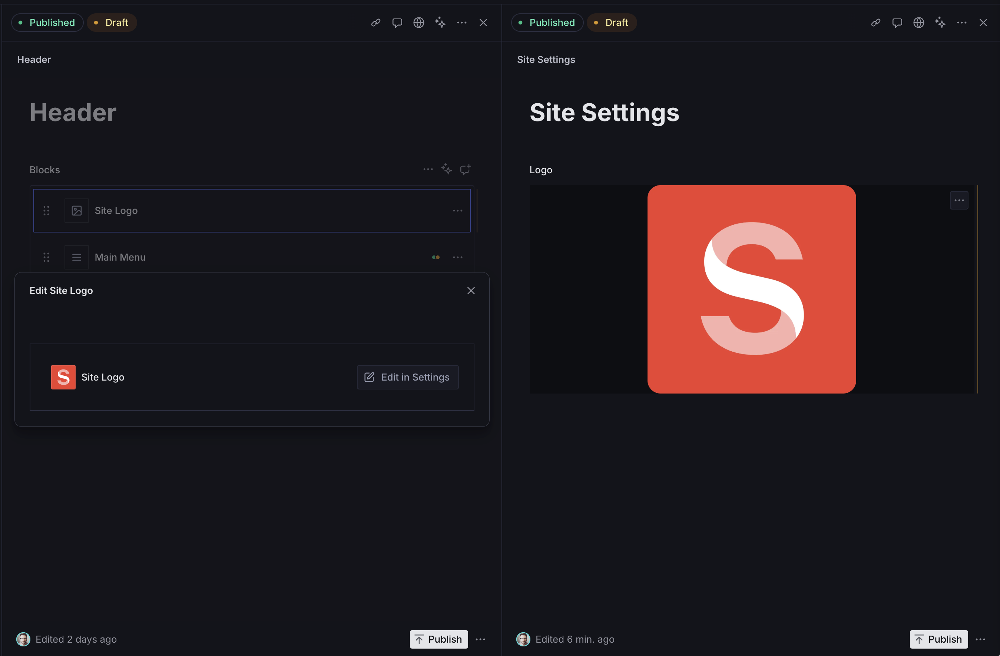
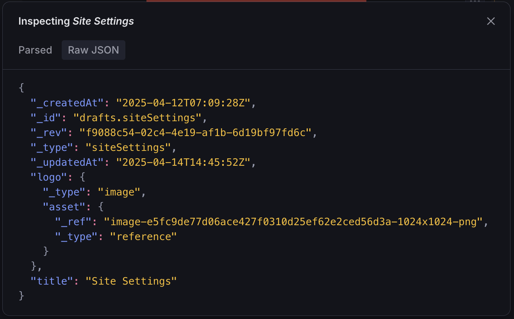

# Site Logo Block

A configurable page builder block for referencing your site's logo.





## Installation

```sh
npm install @trenda/sanity-plugin-page-blocks
```

## Usage

Add it as a plugin in `sanity.config.ts`:

```ts
import {defineConfig} from 'sanity'
import {siteLogoBlock} from '@trenda/sanity-plugin-page-blocks'

export default defineConfig({
  //...
  plugins: [siteLogoBlock()],
})
```

Register it in the schema where you plan to use it:

```ts
import {defineField, defineType} from 'sanity'

export const header = defineType({
  name: 'header',
  title: 'Header',
  type: 'document',
  fields: [
    //...
    defineField({
      name: 'blocks',
      title: 'Blocks',
      type: 'array',
      of: [
        //...
        {type: 'siteLogoBlock'},
      ],
    }),
  ],
})
```

### Customization

#### Query

By default, **Site Logo Block** subscribes to the following query:

`*[_type == "settings"][0]{_id, logo}`

If your logo lives at a different location, you can pass your own valid Sanity query with a projection. Your projection must have the following type:

```ts
{
  _id, logo
}
```

If your logo field is not named `logo`, then you'll need to format the projection with a string literal:

```ts
{
  _id,
  "logo": whateverYourLogoNameIs
}
```

Either way, **Site Logo Block** expects `logo` to be a Sanity image field with a type of `ImageValue`—the same type used for `media` in list previews.

```ts
import {defineConfig} from 'sanity'
import {siteLogoBlock} from '@trenda/sanity-plugin-page-blocks'

export default defineConfig({
  //...
  plugins: [
    siteLogoBlock({
      query: '*[_type == "siteSettings"][0]{_id,logo}',
    }),
  ],
})
```



#### Params

You can also pass [`StructureDocumentPaneParams`](https://www.sanity.io/docs/reference/api/sanity/presentation/StructureDocumentPaneParams), which will be added by the Sanity `Router`. Use with caution as this has not been tested thoroughly.

## TODO

- Add Inline SVG support

## License

[MIT](../../LICENSE) © James Trenda

## Develop & test

This plugin uses [@sanity/plugin-kit](https://github.com/sanity-io/plugin-kit)
with default configuration for build & watch scripts.

See [Testing a plugin in Sanity Studio](https://github.com/sanity-io/plugin-kit#testing-a-plugin-in-sanity-studio)
on how to run this plugin with hotreload in the studio.

### Release new version

Run ["CI & Release" workflow](TODO/actions/workflows/main.yml).
Make sure to select the main branch and check "Release new version".

Semantic release will only release on configured branches, so it is safe to run release on any branch.
