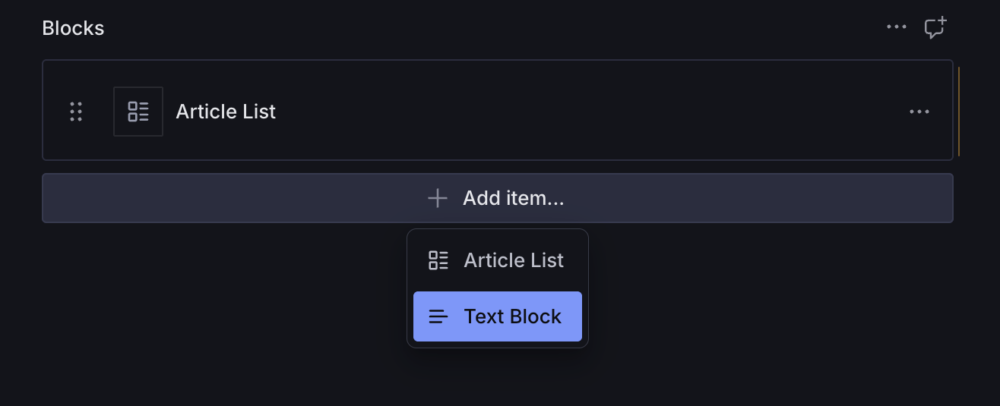
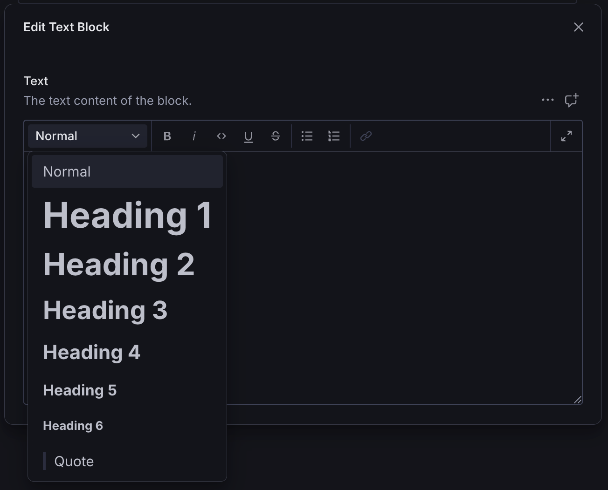
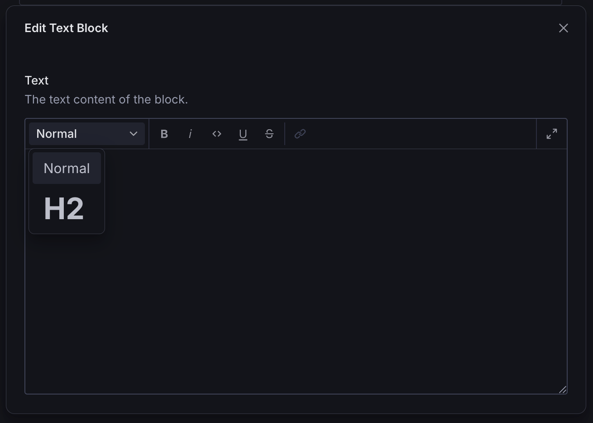
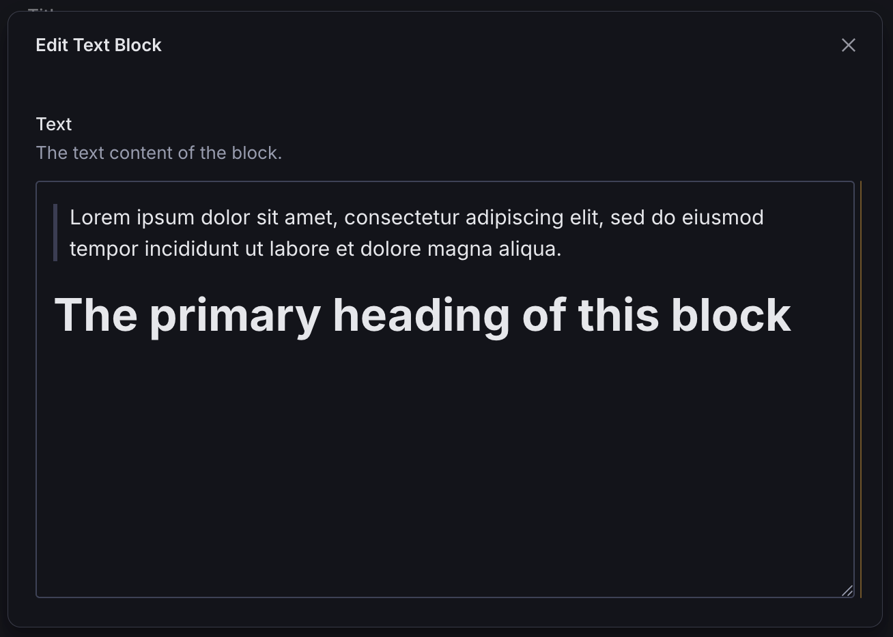
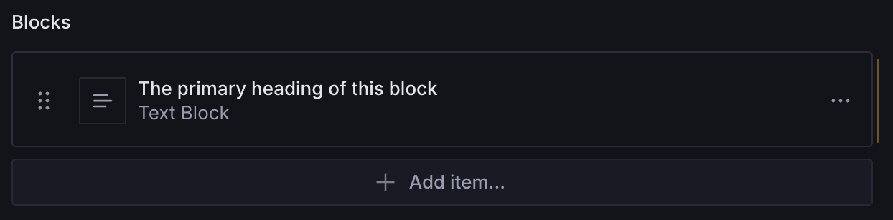

# Text Block

A configurable page builder block for displaying PortableText.

## Installation

```sh
npm install @trenda/sanity-plugin-page-blocks
```

## Usage

Add it as a plugin in `sanity.config.ts`:

```ts
import {defineConfig} from 'sanity'
import {textBlock} from '@trenda/sanity-plugin-page-blocks'

export default defineConfig({
  //...
  plugins: [textBlock()],
})
```

Register it in the schema where you plan to use it:

```ts
import {defineField, defineType} from 'sanity'

export const page = defineType({
  name: 'page',
  title: 'Page',
  type: 'document',
  fields: [
    //...
    defineField({
      name: 'blocks',
      title: 'Blocks',
      type: 'array',
      of: [{type: 'textBlock'}],
    }),
  ],
})
```

Use it in the Studio:



### Customization

You can customize the `textBlock` schema by passing options when registering the plugin.

#### Example: Custom Schema Name

In Sanity, you cannot register multiple schemas with the same name. If you run into a naming conflict with your own `textBlock` schema, you can override it by passing a custom value to `name`.

```ts
import {defineConfig, defineField} from 'sanity'
import {textBlock} from '@trenda/sanity-plugin-page-blocks'

export default defineConfig({
  //...
  plugins: [
    textBlock({
      name: 'myTextBlock',
      //...
    }),
  ],
})
```

#### Example: Custom PortableText schema

By default, `textBlock` includes a default PortableText block schema:



However, if can add your own custom PortableText schema instead:

```ts
import {defineConfig, defineField} from 'sanity'
import {articleListBlock} from '@trenda/sanity-plugin-page-blocks'

export default defineConfig({
  //...
  plugins: [
    textBlock({
      name: 'myTextBlock',
      portableText: defineType({
        name: 'portableText',
        type: 'array',
        of: [
          defineArrayMember({
            type: 'block',
            styles: [
              {title: 'Normal', value: 'normal'},
              {title: 'H2', value: 'h2'},
            ],
            lists: [],
          }),
          // add more types...
        ],
      }),
    }),
  ],
})
```



#### Example: Custom Fields

You can extend the schema with additional fields:

```ts
import {defineConfig, defineField} from 'sanity'
import {textBlock} from '@trenda/sanity-plugin-page-blocks'

export default defineConfig({
  //...
  plugins: [
    textBlock({
      customFields: [
        defineField({
          name: 'myCustomField',
          title: 'My Custom Field',
          type: 'string',
        }),
      ],
    }),
  ],
})
```

#### Example: Custom Preview

Text Block comes with a utility for generating list previews from PortableText. It's designed to work with the standard block styles.



For instance, if you have a Text Block that includes a blockquote followed by a heading, it probably makes the most sense to use the heading as the preview text, rather than the quote. However, the preview will fallback to displaying the quote if that's the only block style in the array.



You can override the default preview by providing your own configuration:

```ts
import {defineConfig, defineField} from 'sanity'
import {textBlock} from '@trenda/sanity-plugin-page-blocks'

export default defineConfig({
  //...
  plugins: [
    textBlock({
      preview: {
        select: {
          text: 'text',
        },
        prepare(selection) {
          return {
            title: 'Whatever you want',
          }
        },
      },
    }),
  ],
})
```

## License

[MIT](LICENSE) © James Trenda

## Develop & test

This plugin uses [@sanity/plugin-kit](https://github.com/sanity-io/plugin-kit)
with default configuration for build & watch scripts.

See [Testing a plugin in Sanity Studio](https://github.com/sanity-io/plugin-kit#testing-a-plugin-in-sanity-studio)
on how to run this plugin with hotreload in the studio.

### Release new version

Run ["CI & Release" workflow](TODO/actions/workflows/main.yml).
Make sure to select the main branch and check "Release new version".

Semantic release will only release on configured branches, so it is safe to run release on any branch.
